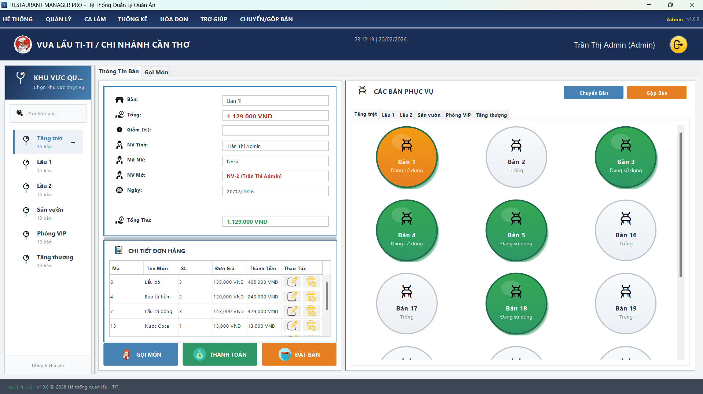
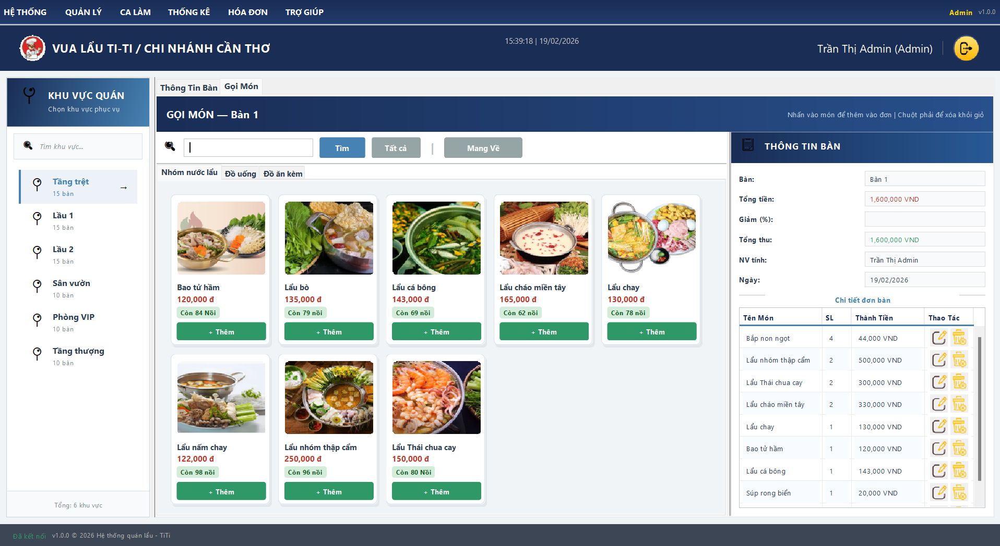
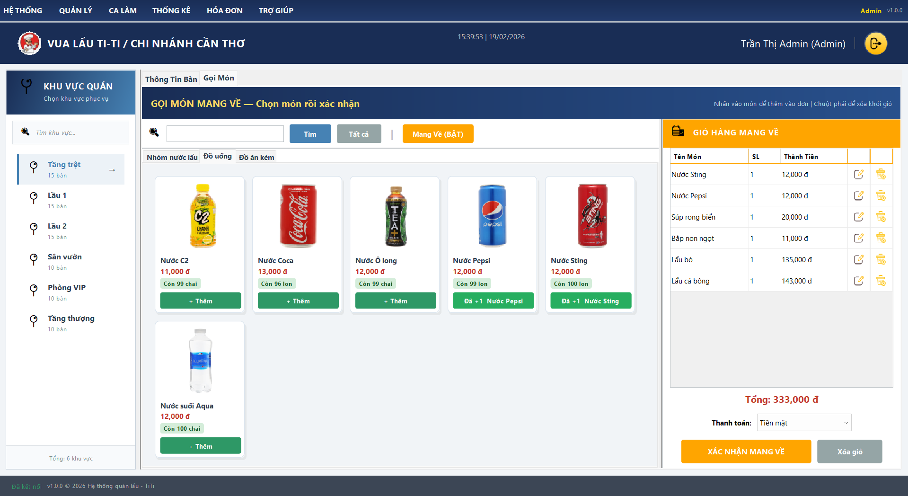
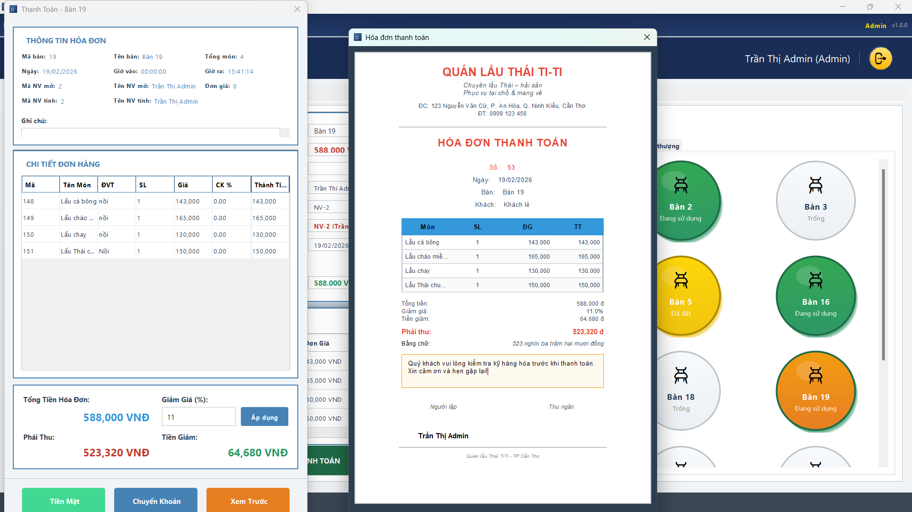
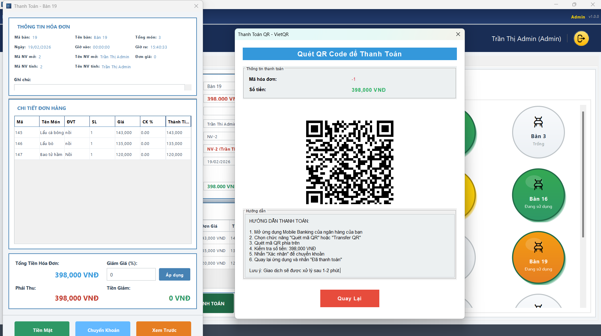
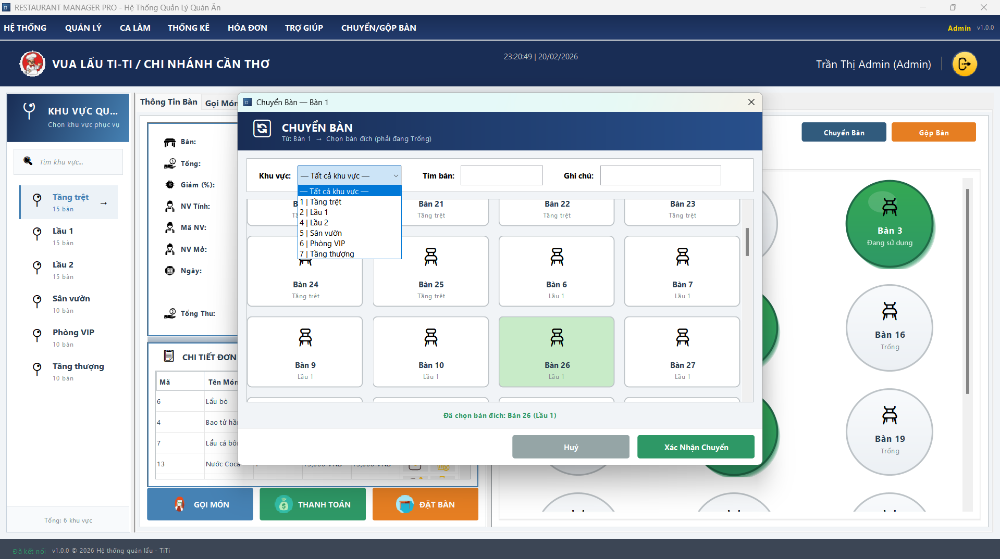
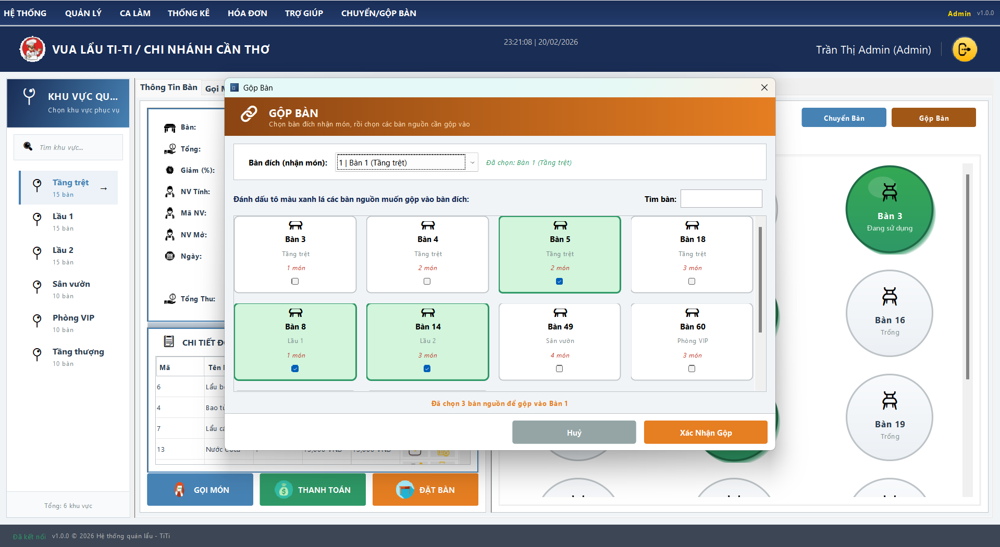
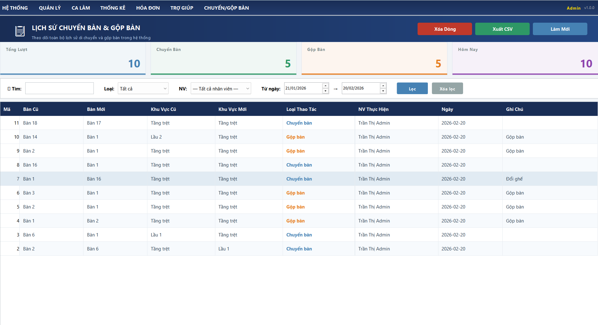
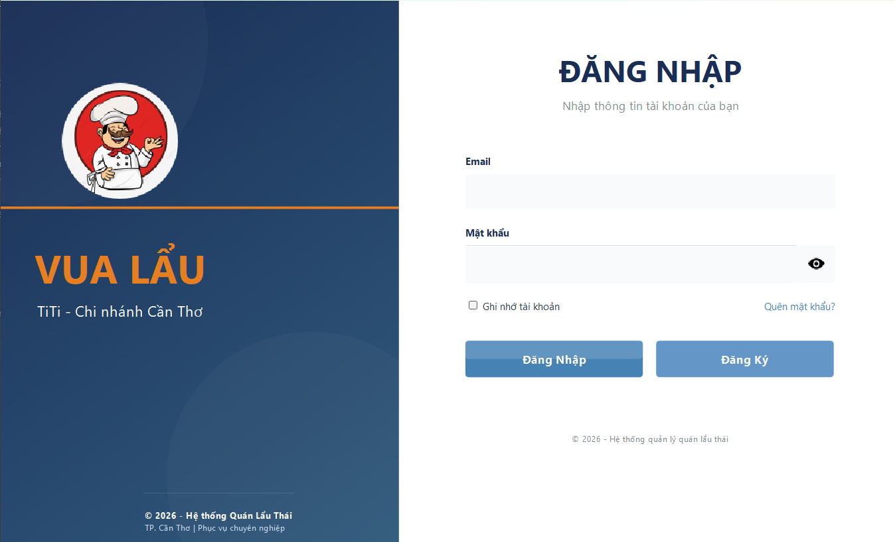
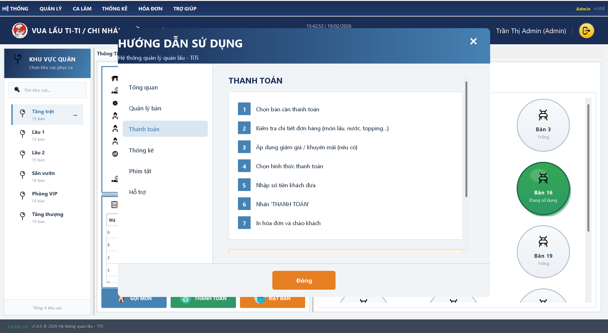

# 🍽 HỆ THỐNG QUÁN ĂN CHUYÊN NGHIỆP

## 📌 Công nghệ sử dụng
- Java Swing
- JDBC
- SQL Server

## 📂 Cấu trúc thư mục
- config: Kết nối database
- dao: Xử lý truy vấn
- model: Đối tượng dữ liệu
- view: Giao diện người dùng
- util: Hàm tiện ích

## 📷 Hình ảnh giao diện

  

  

  

  

  

  

  

  

  

  

